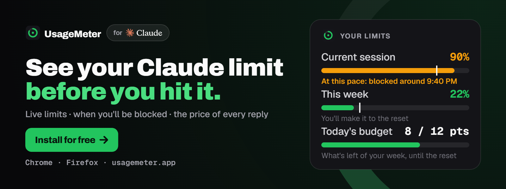
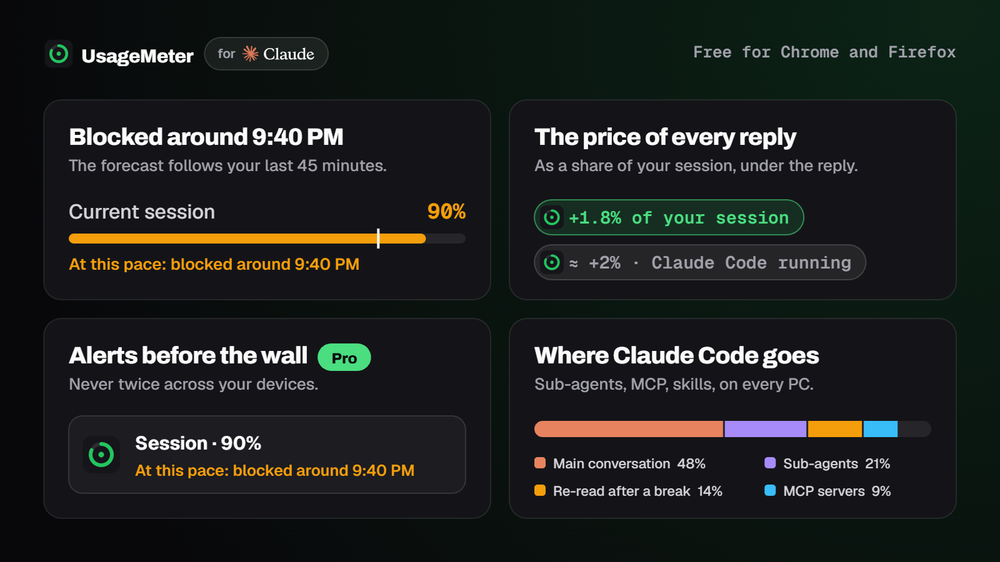

<!-- UsageMeter: the two images live in ./assets of this repository -->

  

<h2 align="center">Hi, I'm @PiloteCode. I build <a href="https://usagemeter.app/?utm_source=github&utm_medium=profile&utm_campaign=creator_readme">UsageMeter</a>.</h2>

  The free extension that shows your Claude limits live, tells you when you'll be blocked 
  and what every reply costs. Plus <b>UsageMeter Link</b> for Claude Code on every PC.

  
  
  
  

---

## My Claude, live

Measured by UsageMeter on my own machines. The cards update every hour, my limits every 5 minutes.

  <a href="https://usagemeter.app/?utm_source=github&utm_medium=profile&utm_campaign=creator_readme">
    <picture>
      <source media="(prefers-color-scheme: dark)" srcset="https://usagemeter.app/api/badge/yhzn37yuca/streak.svg?style=badge&size=lg">
      
    </picture>
  </a>
  <a href="https://usagemeter.app/?utm_source=github&utm_medium=profile&utm_campaign=creator_readme">
    <picture>
      <source media="(prefers-color-scheme: dark)" srcset="https://usagemeter.app/api/badge/yhzn37yuca/tokens.svg?style=badge&size=lg">
      
    </picture>
  </a>
  <a href="https://usagemeter.app/?utm_source=github&utm_medium=profile&utm_campaign=creator_readme">
    <picture>
      <source media="(prefers-color-scheme: dark)" srcset="https://usagemeter.app/api/badge/yhzn37yuca/models.svg?style=badge&size=lg">
      
    </picture>
  </a>

  <a href="https://usagemeter.app/?utm_source=github&utm_medium=profile&utm_campaign=creator_readme">
    <picture>
      <source media="(prefers-color-scheme: dark)" srcset="https://usagemeter.app/api/badge/yhzn37yuca/heatmap.svg?size=lg">
      
    </picture>
  </a>

  <a href="https://usagemeter.app/?utm_source=github&utm_medium=profile&utm_campaign=creator_readme">
    <picture>
      <source media="(prefers-color-scheme: dark)" srcset="https://usagemeter.app/api/badge/yhzn37yuca/tokens.svg">
      
    </picture>
  </a>
  <a href="https://usagemeter.app/?utm_source=github&utm_medium=profile&utm_campaign=creator_readme">
    <picture>
      <source media="(prefers-color-scheme: dark)" srcset="https://usagemeter.app/api/badge/yhzn37yuca/models.svg">
      
    </picture>
  </a>

  <a href="https://usagemeter.app/?utm_source=github&utm_medium=profile&utm_campaign=creator_readme">
    <picture>
      <source media="(prefers-color-scheme: dark)" srcset="https://usagemeter.app/api/badge/yhzn37yuca/limits.svg">
      
    </picture>
  </a>
  <a href="https://usagemeter.app/?utm_source=github&utm_medium=profile&utm_campaign=creator_readme">
    <picture>
      <source media="(prefers-color-scheme: dark)" srcset="https://usagemeter.app/api/badge/yhzn37yuca/cost.svg">
      
    </picture>
  </a>

<a href="https://usagemeter.app/widgets?utm_source=github&utm_medium=profile&utm_campaign=creator_readme">Put your own Claude stats on your profile →</a>

---

## Why UsageMeter

  

- **Blocked around 9:40 PM, at this pace.** The forecast follows your last 45 minutes.
- **The price of every reply** on claude.ai, as a share of your session. Never a wrong figure.
- **Alerts before the wall** (Pro), never twice across your browsers and the Link app.
- **Where your Claude Code tokens go:** sub-agents, MCP servers, skills, with UsageMeter Link.
- **Claude on your GitHub profile:** the widgets above, free.

  
  

---

## On GitHub

  
  

  

Built with 
  
  
  
  
  
  
  

UsageMeter is an independent tool, not affiliated with Anthropic. Claude is a trademark of Anthropic, PBC.

